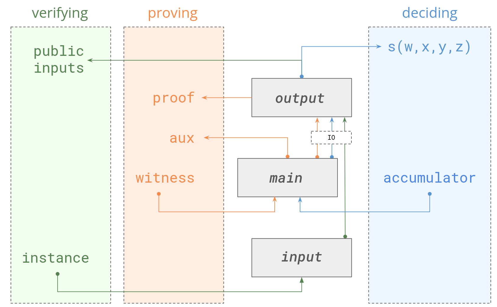

+++
title = "Ragu for Orchard: Recursion Al Dente"
authors = ["Sean Bowe"]
+++

>  This blog post is intended for a technical audience. Reader discretion is advised.

Project Tachyon, as I introduced in my [last blog post](@/blog/2025-04-02__tachyon_scaling_zcash_oblivious_synchronization.md), leans heavily on proof-carrying data (PCD) to tackle the toughest challenges in scaling Zcash’s shielded payments. We need a toolkit aimed specifically at the cryptography we deployed in our [Orchard](https://zcash.github.io/orchard/) payment protocol — recursive proofs with the [Pasta curve cycle](https://electriccoin.co/blog/the-pasta-curves-for-halo-2-and-beyond/) — that can accomodate our specific needs and adapt to the active landscape of new PCD protocols based on accumulation (or “folding”) schemes.

We have several specific needs, including:

* **We need a solution adapted for Orchard.** If we use something off-the-shelf like [kimchi](https://github.com/o1-labs/proof-systems/tree/master/kimchi) — which is certainly an option to consider — we'll be forced to use cryptography that is years out of date by now and comparatively inefficient for our protocol.[^1] We need our proving system to meet the needs of Orchard (and Tachyon), not the other way around.[^2]
* **We need something simpler to write circuits for.** We don't mind writing circuits by hand, but when the underlying arithmetization forces us to make intense optimization efforts like we did with the [`halo2_proofs`](https://docs.rs/halo2_proofs) and [`orchard`](https://docs.rs/orchard) crates, the resulting codebase is extremely difficult to understand and maintain, not to mention audit.[^3] My ideal choice would be to use an R1CS-like arithmetization with escape hatches for more advanced stuff (e.g. lookups) in the situations where it's necessary.[^4]
* **We need to handle non-uniform circuits efficiently.** Our PCD tree will handle many different circuits at different nodes, and when the underlying protocol natively supports switching between these (according to well-defined rules) it is far simpler and more efficient than an _ad hoc_ approach with pre-processed proving keys that have to be carried around through the computational graph.

I've been working on a PCD toolkit called `ragu`, written in Rust, that is intended to fit within Zcash's performance and complexity budget. It supports non-uniform circuits, uses a simple R1CS-like arithmetization, avoids complicated subprotocols, avoids FFTs most of the time, supports [split accumulation](https://eprint.iacr.org/2020/1618), and is built specifically for the Pasta curves that are native to the Orchard shielded protocol. It's still under heavy development and the underlying proving system is not a main focus of my development effort; **my current priority is building the API that I want for Tachyon, and working backwards from there to find the cryptography that meets our needs.**

Currently, `ragu` uses an arithmetization similar to R1CS and its API is inspired heavily by what you'd see in other Rust toolkits like [`arkworks`](https://github.com/arkworks-rs), [`kimchi`](https://github.com/o1-labs/proof-systems/tree/master/kimchi) and our very own [`bellman`](https://docs.rs/bellman/latest/bellman/) used in Sapling. Thanks to numerous language features that have shipped in Rust in the last several years, we can really improve on those APIs _and_ make our circuit synthesis code much more efficient, which is absolutely necessary for various things like non-uniform circuits.

I'm not ready to share the code yet, but I am excited to share some of the details about the crate's design decisions so far.

## Speedy Circuit Synthesis

In most SNARK toolkits the witness generation logic is embedded alongside the codepaths that are responsible for constructing the corresponding constraints, allowing common abstractions to be shared and reducing the chance of fatal soundness bugs. This gets tricky when the circuit must be synthesized in a context where the witness is unknown, like during the one-time parameter generation of most pre-processing SNARKs, since the code must accomodate both contexts simultaneously with as little overhead as possible.

However, because our protocol leverages non-uniform circuits (as in [HyperNova](https://eprint.iacr.org/2023/573) and similar schemes) and does not have a pre-processing step, the circuit synthesis code is frequently invoked[^5] throughout the PCD tree in order to transition from one circuit to another. It is also applied during the decision procedure by the verifier. **This means that circuit synthesis is a hot path that must be optimized.**

### `Maybe<T>`

The first optimization and ergonomic improvement in `ragu` comes from the use of an abstract alternative to `Option<T>` for encoding witness values. In most Rust-based SNARK toolkits the circuits are written so that (auxillary) witness information _might_ exist at runtime and is therefore represented with `Option<T>`. During proof generation the witness information is transformed into a fallible `Result<T, SynthesisError>` (or similar) and the error case is propagated upward and caught by the driver of the synthesis if needed. This works, with several drawbacks:

1. The `Option<T>` exists throughout synthesis in contexts where we can theoretically know (statically) that it should _exclusively_ occupy the `Some(T)` variant _or_ only the `None` variant, depending on the underlying driver of synthesis. After monomorphization, we can know with certainty that an `Option<T>` is not actually required, but the compiler cannot optimize it away! This leads to pointless branching at runtime, wasted stack space for storing discriminants and completely unnecessary (and potentially large) allocations outside of proof generation.
2. The failure case of an unexpected missing witness needs to be handled: either we `panic!` at runtime (a bad idea here!) or we could bubble it up as an error to the driver. This requires every code path that potentially touches witness data to propagate an error, even though only very few codepaths actually result in _any_ error during synthesis.[^6] Once you start dealing with iterators, multi-threaded synthesis optimizations, embedded witness generation logic, etc. it gets obnoxious to write code full of pointless error handling cases that should be prevented at compile-time.
3. It's best to avoid leveraging `Option<T>`'s monadic operators outside of limited areas of the API, since it will require the compiler to codegen these operations even in contexts where they're _never_ invoked; the compiler cannot optimize any of this away in dead-code elimination passes because it's using a runtime `enum` discriminant to conditionally invoke functions. This is unfortunate because it's very convenient to invoke these operators on infallible morphisms.

The `ragu` crate introduces a higher-kinded abstraction called `Maybe<T>` which is a generalization of an `Option<T>` except that it's a kind of indexed monad: the _concrete_ type of a `Maybe<T>` is either represented by an `Always(T)` type that transparently wraps `T` or a zero-sized `Empty` type that mimics `()`. In other words, it is an opaque generalization over the _variant_ of an `Option` rather than the type.[^7]

The trait looks something like this, from a user's perspective:

```rust
pub trait MaybeKind {
    type Rebind<T>: Maybe<T, Kind = Self>;
}

pub trait Maybe<T> {
    type Kind: MaybeKind;

    fn just<F: FnOnce() -> T>(f: F) -> Self;
    fn take(self) -> T;
    fn map<U, F>(self, f: F) -> <Self::Kind as MaybeKind>::Rebind<U>
    where
        F: FnOnce(T) -> U;
    fn view(&self) -> <Self::Kind as MaybeKind>::Rebind<&T>;
    fn snag(&self) -> &T {
        self.view().take()
    }
    
    /* ... and many omitted methods ... */
}
```

The full API is a limited form of the `Option<T>` API with some methods that I'll highlight:

* `Maybe<T>::just` can be used to create a `Maybe<T>`, but if the backing store is `Empty` then the provided closure is not called and _cannot_ not survive dead-code elimination. The concrete type is zero-sized and after compiler optimizations it consumes _no_ memory when the driver doesn't need witness values.
* `Maybe<T>::take` can be used to obtain the content within, which is a simple no-op move if the backing store is `Always(T)`, but if the backing store is `Empty` then this fails at _compile-time_. You should only call `take` in contexts where the API guarantees the backing store is `Always(T)` as I'll discuss later.
* `Maybe<T>::map` (and its friends like `and_then`) work like you'd expect. If the backing store is `Empty` they are no-ops and their closures also _must_ be eliminated by the compiler, otherwise the operation is _always_ applied and does not accomodate a failure case. There's a little higher-kinded type glue but it's hidden from the user.
* `Maybe<T>::view` works kind of like `Option<T>::as_ref` except that `as_ref` is defined for `&T` so `view` avoids the ambiguity.[^8] I also have a `view_mut` method that comes in handy.
* `Maybe<T>::snag` is a convenience method that is useful for avoiding moves when necessary.

None of these methods are fallible and yet they can be used to deal with a large amount of witness generation logic in practice. In the contexts where errors do need to be handled, or in places where many monadic operators need to be applied, the underlying driver `D` provides a `D::with` method that takes a closure like this:

```rust
let b = D::with(|| {
    let proof = &witness.snag()[i];
    let proof_id = *proof_ids[i].value().snag();
    let y = y.value().take();
    let z = z.value().take();

    let mut tmp = self.multi.rXz(
        z,
        &proof.a,
        &proof.b,
        &proof.c,
    );

    for (tmp, s) in tmp.iter_mut()
                       .zip(self.multi.wXyz(proof_id, y, z)?)
    {
        *tmp += s;
    }

    Ok(tmp)
});
```

Here, `witness`, `proof_id[i].value()`, `y` and `z` are all `Maybe`-types and yet there is no need to handle the runtime possibility of them being absent. The code looks like it's working directly with the values because that's what it's _actually doing_: if the driver doesn't need a witness, the closure is not even compiled and none of the inner calls to `.take()` or `.snag()` are compiled either, which is essential to making this work.[^9]

There are _many_ situations where this new abstraction can enable extremely convenient circuit synthesis code. As an example, if you have a `Vec<M>` where `M: Maybe<T>` then _when the driver doesn't need a witness_ the value `M` is a zero-sized type and so `Vec<M>` never allocates at runtime; otherwise, it's the _exact same_ as a `Vec<T>`. This also means that you can borrow a `Maybe<&[T]>` from a `&[Maybe<T>]` without any overhead or `unsafe` code.[^10] These things are not possible in existing Rust SNARK toolkits which have to pay for the pointless memory layout consequences at runtime.

### `Driver`

I've alluded to this concept of a “driver” which can be thought of as a compile-time specialized context for how the circuit is synthesized at runtime. The driver acts as a substitute for [`ConstraintSystem<F>`](https://docs.rs/bellman/latest/bellman/trait.ConstraintSystem.html) and exposes a more generic interface to the synthesis logic that gives the driver much more flexibility. This is what an _abbreviated_ description of a driver is:

```rust
pub trait Driver {
    type F: Field;
    type W: Clone;
    const ONE: Self::W;

    type MaybeKind: maybe::MaybeKind;

    fn with<R>(
        f: impl FnOnce() -> Result<R, SynthesisError>,
    ) -> Result<Witness<Self, R>, SynthesisError>;
}

pub type Witness<D, T> = <<D as Driver>::MaybeKind as maybe::MaybeKind>::Rebind<T>;
```

The `Driver::with` method is the one I spoke about before, and the `MaybeKind` associated type is part of the glue used to make the `Maybe<T>` type work seamlessly when rebinding using operators like `map`, `or_else` and so on. The `Witness<D, T>` type alias exists as a way to easily name the concrete type that implements `Maybe<T>` throughout synthesis.

**The more interesting changes are the introduction of the `F` and `W` associated types.** The `Driver` is defined for a concrete driver that supports a specific field `F` but the trait itself is not generic over one, unlike `ConstraintSystem<F>`. This emerges naturally and results in fewer generics scattered around; just use `D::F` to refer to the field instead of `F` in cases where the type system hasn't unified it with another type you already know about. (I've written a lot of different gadgets with this API and I can assure you this is much better.)

The `D::W` associated type represents an abstract wire type. All you can do is clone it. In other SNARK toolkits when you ask the backend to allocate a variable (or wire) in your constraint system it will return a concrete wire type that internally points to a specific part of the witness for later use by the backend. This usually works just fine, but in our case we have drivers with various different needs for what this wire value should actually represent.

* **During proof generation:** The wire represents a position in the witness just like in other toolkits.
* **During verification of a non-succinct witness:** The wire represents the value of the witness (a field element) read directly from the proof.
* **During the computation of public inputs:** As we'll see later, it becomes far simpler if the circuit code can reconstruct the public inputs (as the circuit intends to interpret them) if the circuit code that constructs the public input during verification is _the same_ as the code that does so within the circuit itself. In this case, the wire value is also just a value because we only care about the public input values and none of the interstitial values used to compute it.

However, the most important benefit of this abstraction is for dealing with evaluation of non-uniform circuit polynomials.[^11] Briefly, `ragu` internally uses a 4-variate polynomial $s(W, X, Y, Z)$ to describe all of the circuits in the PCD tree.

###### ") { #swxyz }

We do not store this entire polynomial in memory because it would be absolutely humongous. We only ever need to evaluate a _restricted_ form of this polynomial (with zero or one free variables) so it's easier, simpler and more efficient to evaluate the polynomial as part of circuit synthesis itself.

* **During verification:** Computation of $s(W, x, y, Z)$ uses a driver that feeds the partially evaluated polynomial into the circuit as the abstract wire value. **The circuit synthesis code is inadvertently evaluating the polynomial on behalf of the backend!** This is fantastic because it doesn't require any extra heap allocation to compute. (The remaining restrictions are simple because the polynomials are either succinct or of low degree.)
* **During proof generation:** Computations of $s(w, X, y, z)$, $s(w, x, Y, z)$ have their own distinct drivers that efficiently evaluate the polynomials in their own way, using similar techniques to get the circuit synthesis code to evaluate the polynomials partially on our behalf.

Finally, there are three additional methods that the `Driver` provides:

```rust
    fn mul(
        &mut self,
        values: impl FnOnce() -> Result<(Self::F, Self::F, Self::F), SynthesisError>,
    ) -> Result<(Self::W, Self::W, Self::W), SynthesisError>;

    fn add<L: IntoIterator<Item = (Self::W, Self::F)>>(
        &mut self,
        lc: impl FnOnce() -> L,
    ) -> Result<Self::W, SynthesisError>;

    fn enforce_zero<L: IntoIterator<Item = (Self::W, Self::F)>>(
        &mut self,
        lc: impl FnOnce() -> L,
    ) -> Result<(), SynthesisError>;
```

The `mul` method produces a multiplication constraint given a closure that returns an assignment for the two input wires and one output wire of a multiplication gate in an arithmetic circuit. The closure is only invoked when a witness is expected, so inside the closure you can call `Maybe<T>::take()` just as you can do in the `with` method. The method returns three new wires that can be used in linear constraints.

The `add` and `enforce_zero` methods, in contrast, only invoke their closure when we do _not_ expect a witness. The `add` method effectively takes a linear combination of wires and computes a new wire — in the underlying proving system, this just produces a _virtual_ wire that costs (essentially) nothing and sometimes improves synthesis performance. The `enforce_zero` method creates a linear constraint that requires some linear combination of previously-allocated wires to be zero.

### `Circuit`

The `Circuit<F>` trait that you're more familiar with if you've used `halo2` or `bellman` essentially consists of a single method called `synthesize` that creates all of the constraints and the witness data (if applicable) given a `ConstraintSystem<F>`. The `ragu` crate uses a much more generalized dataflow to deal with edge cases that this API design cannot easily handle. The circuit consists of three methods: `input`, `main` and `output` which work as follows:

######  { #ragucircuit }

This arrangement splits out some of the logic that took place solely in the old `synthesize` method. As you can see from the diagram, the verification path through the circuit code starts from a circuit-defined instance type that is fed into the `input` method, and rather than used by the `main` method is directly fed into the `output` method to obtain the public input. In proving, the path starts as a witness that goes through the `main` method and takes the same route through the `output` method to synthesize the same public inputs, ensuring the same logic that is used to generate and relate public inputs between the circuit and outside code reuses the same code paths and abstractions.

There are further advantages to this more complicated arrangement. The core proving code (in `main`) can produce auxillary data in the process which is used by the user who invoked the proof generator; this is useful when the witness generation procedure is itself performing “folding” operations and constructing accumulators that will be needed to verify the proof. And circuits with simple behaviors can plumb these procedures together. As an example, if you have a circuit where the instance itself is identical to the witness, the `main` procedure can invoke the `input` method and the resulting `IO` value can be returned from the `main` method after the remainder of the circuit has been synthesized.

Here's the `Circuit` trait in all its glory:

```rust
pub trait Circuit<F: Field> {
    type Instance<'instance>;
    type IO<D: Driver<F = F>>;
    type Witness<'witness>;
    type Aux;

    fn input<'instance, D: Driver<F = F>>(
        &self,
        dr: &mut D,
        input: Witness<D, Self::Instance<'instance>>,
    ) -> Result<Self::IO<D>, SynthesisError>;

    fn main<'witness, D: Driver<F = F>>(
        &self,
        dr: &mut D,
        witness: Witness<D, Self::Witness<'witness>>,
    ) -> Result<(Self::IO<D>, Witness<D, Self::Aux>), SynthesisError>;

    fn output<D: Driver<F = F>>(
        &self,
        dr: &mut D,
        io: Self::IO<D>,
        output: &mut D::IO,
    ) -> Result<(), SynthesisError>;
}
```

## Continued...

In the next blog post about `ragu` I'll be talking about the specific tools and techniques it provides to circuits that will be useful in the development of Tachyon.

One of the things I'll be talking about, as I delve deeper into the underlying proof system that `ragu` provides, is how the new circuit design facilitates a compositional strategy that drivers can exploit to more efficiently evaluate many polynomial restrictions simultaneously. Because most nodes in the PCD tree share similar behaviors and logic, and because of the nature of our arithmetization, we can use compositional tricks (leveraging the `Aux` concept, among other things) to build complicated circuits from subcircuits that our proof generation and decision drivers can easily take advantage of to speed up polynomial evaluations considerably.

That's it for now. **As always, if you're interested in this kind of work, please get in touch with me!**

-----

[^1]: `kimchi` uses PLONKish, like `halo2`. This is a non-starter for us. We need to support split accumulation and (dense) non-uniform circuits. Our protocols will also need exotic tools such as first-class support for polynomial oracles and we'd like to leverage modern techniques to avoid or mitigate the cost of foreign field arithmetic, such as [CycleFold](https://eprint.iacr.org/2023/1192). It would be very costly to adapt `kimchi` for these purposes.
[^2]: We could introduce a new shielded protocol and use something like [`plonky3`](https://github.com/Plonky3/Plonky3) but these projects are designed to accomodate a _wide_ variety of different proving systems and cryptographic primitives, and are still changing rapidly. In general though, it's extremely painful to ship a new shielded protocol in Zcash unless well-motivated by a soundness problem or something else.
[^3]: Ideally, we'd be writing our circuits in a DSL like [Noir](https://noir-lang.org/), but existing DSLs are too far removed from the underlying proving system for our use case. We cannot afford an intermediate representation, for example, since circuit synthesis itself is a major hot path in our code when using non-uniform circuits.
[^4]: Writing circuits in R1CS comes with the added advantage that many modern tools used to automatically discover soundness and completeness bugs in constraint systems can be directly applied to our codebase.
[^5]: This essentially works by combining all of your circuits into a giant multivariate interpolation polynomial and evaluating over different restrictions of the polynomial depending on the context, which means the circuit needs to evaluated in its polynomial representation even more often than the witness itself.
[^6]: There are exceptions for things like division by zero, which still must be handled with errors, but this happens very rarely.
[^7]: Technically, the backing store is a `struct Always<T>(T);` or a `struct Empty;` which provides an equivalent zero-cost abstraction in both cases, but this is strictly an implementation detail.
[^8]: Inherent methods get precedence over trait methods, which is why `Option<T>` never has this problem but we do.
[^9]: If the closure were actually compiled it would result in a compile-time error because we panic in an inline `const` block in a _generic_ context, which waits until after monomorphization and dead-code elimination passes to invoke `const` expressions.
[^10]: It is even possible to transmute a `Vec<M>` into a rebound `Maybe<Vec<T>>` with `unsafe` code.
[^11]: Although this is technically an artifact of the specific proof system we're currently using, something very similar happens inside of [HyperNova](https://eprint.iacr.org/2023/573) for almost identical reasons, so we'll likely want to accomodate this while exploring this territory of the API design.
