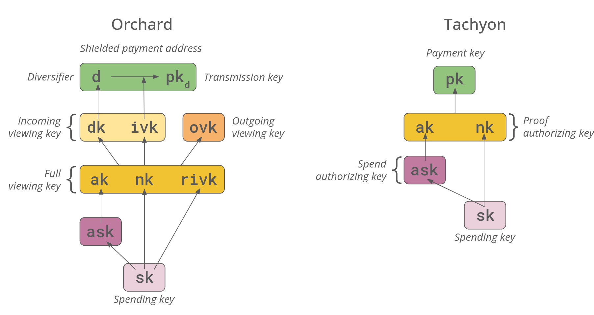
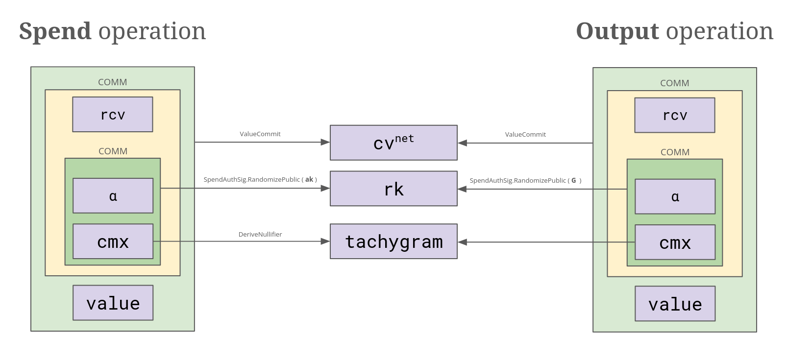
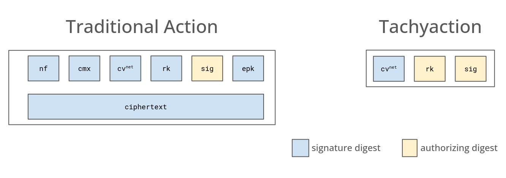

+++
title = "Tachyaction at a Distance"
authors = ["Sean Bowe"]

[extra]
# page_history = true
# page_history_url = "https://github.com/ebfull/seanbowe.com/commits/master/content/blog/2025-05-15__tachyaction_at_a_distance/"
page_justification = true
+++

>  This blog post is intended for Zcash protocol developers. Reader discretion is advised.

######  { #orchard_vs_tachyon }

[Tachyon](@/blog/2025-04-02__tachyon_scaling_zcash_oblivious_synchronization.md) fully embraces **[out-of-band payments](@/blog/2025-04-02__tachyon_scaling_zcash_oblivious_synchronization.md#shielded-notes-and-commitments)** for the first time in a Zcash shielded protocol. This is being done to ensure the protocol can plausibly scale, but comes with some consequences for the user experience surrounding payments. I'll be discussing that in more detail in a future blog post, but for now it is fun to glimpse at what the protocol looks like in the absence of in-band secret distribution.

In many ways the protocol becomes simpler and begins to resemble the original [Zerocash](https://eprint.iacr.org/2014/349) construction. However, Tachyon still preserves some of the ideas we deployed in the [Orchard](https://zcash.github.io/orchard/design.html) shielded protocol: in particular, we'll still use RedPallas key re-randomization, homomorphic value commitments and binding signatures, and a partitioned key structure that allows proof delegation without conferring spend authority.

The two other prongs of Tachyon's design are more complicated and involve novel ideas and clever cryptography: **[oblivious synchronization](@/blog/2025-04-02__tachyon_scaling_zcash_oblivious_synchronization.md#oblivious-synchronization)** and **[shielded transaction aggregates](https://github.com/zcash/zcash/issues/4946)**. These have some non-trivial impacts on the transaction model that relate to how signing works and how shielded state changes are communicated in the protocol.

I'll dive into those topics in their own blog posts as well, but we can begin to sketch their effects on the larger protocol as far the the consensus protocol is concerned.

### Turnstiles

First, a disclaimer. **Tachyon is a reverse-compatible change to the [Orchard protocol](https://zcash.github.io/orchard/design.html).**

Tachyon can be integrated into the Zcash protocol either as an upgrade to the existing Orchard shielded pool _or_ as a standalone shielded pool by incorporating a [turnstile](https://zips.z.cash/zip-0209). There are positive and negative consequences for either deployment path. I'll be discussing this in more detail very soon, but the deployment strategy does not influence any of the design decisions for Tachyon mentioned in this blog post.

## Simpler Foundations

Tachyon removes in-band secret distribution, meaning the Zcash blockchain cannot be (easily) used to communicate with your counterparty or store/share wallet information. This requires those functions to exist in a higher-level protocol supported by your wallet.

As a consequence nearly all of the design complexity of the key derivation tree is punted out of the core protocol and out of the zk-SNARK circuits.

######  { #tachyon_keys }

This removes key diversification, viewing keys, and even payment addresses. “Payment keys” in Tachyon are used by wallet software as part of a larger protocol such as a [payment request](https://zips.z.cash/zip-0321) or a [URI encapsulated payment](https://zips.z.cash/zip-0324). We still have some structure in this reduced form of the protocol, mainly to separate the capability to construct proofs ($"ak", "nk"$) from the ability observe when funds are spent ($"nk"$) or to authorize the spend of funds ($"ask"$).

The simplified key structure makes shielded notes simpler as well. Recall that in Orchard they are [defined](https://zips.z.cash/protocol/protocol.pdf#notes) as:

$$
(d, "pk"_d, "v", rho, Psi, "rcm")
$$

Tachyon removes the diversifier $d$ because payment addresses are removed. The transmission key $"pk"_d$ is substituted with a payment key $"pk"$. The unique value $rho$ is no longer needed because Tachyon does not need to defend users against “faerie gold” attacks.[^1]

This means that Tachyon's notes are simpler:

$$
("pk", "v", Psi, "rcm")
$$

Besides the payment key $"pk"$ and note value $"v"$ the note only contains a nonce $Psi$ and a commitment key $"rcm"$, both of which could be derived from a shared key that is negotiated through the out-of-band payment protocol.

**Tachyon nullifiers are derived and handled differently by the protocol due to oblivious synchronization.** Consensus validators only need to retain the last $k$ blocks worth of nullifiers and reject transactions that reveal duplicate nullifiers within this range, after which older nullifiers can be pruned permanently by the validator. In exchange users are required to prove their notes were spendable up until a recent point in the history of the chain (well within $k$ blocks).

Users will outsource the creation of these proofs to an _untrusted_ third party called an “oblivious syncing service” that does not learn about the user's wallet or transactions. In order to achieve this strong privacy guarantee all nullifiers in Tachyon have an additional component that I'll call “flavor” for now. In a future blog post on oblivious synchronization I will elaborate over the mechanics of this derivation.

Together with the changes to the notes, nullifiers in Tachyon can be massively simplified. Orchard defines nullifiers as:

$$
"nf" = "Extract"_bb(P)([(F_("nk")(rho) + Psi) mod p] cal(G) + "cm")
$$

where $F$ is a keyed PRF; Orchard uses [Poseidon](https://eprint.iacr.org/2019/458) for this purpose.

There is a [great explanation](https://zcash.github.io/orchard/design/nullifiers.html) for the complexity in the Orchard book, but the design boils down to countering faerie gold attacks and making weak assumptions about circuit-efficient PRFs. As mentioned, $rho$ is removed from notes. Also, oblivious synchronization will not support the previous arrangement involving the note commitment ($"cm"$).

Tachyon should settle for a simpler nullifier:

$$
"nf" = F_("nk")(Psi || "flavor")
$$

with $F$ being a keyed PRF we're comfortable with.[^2] The selection of primitives amongst the trade-off space will be a delightful conversation to have later in the design process. The many years that have elapsed since Orchard's design (and the more forgiving environment of non-uniform circuits in proof-carrying data constructions) should give us more options and confidence this time around.

## Tachygrams, Tachystamps, and Tachyactions

The consensus protocol does not need to distinguish between Tachyon's nullifiers and note commitments that are revealed in blocks — they are treated identically as 32-byte blobs that are recorded in the blockchain. Let us refer to these generally as “tachygrams.”

The purpose of this unification is to simplify the protocol: there's no pressing need to distinguish between the two for performance reasons, and their unification allows a single accumulator to be used both for membership and non-membership proofs. Although not a goal, this unification may naturally result in their indistinguishablity.

Tachyon allows Spend and Output operations to occur independently of each other, similar to Sapling[^3], except that their behavior is also unified: regardless of the operation a $("cv"^"net", "rk")$ pair are produced. The operation is authorized by $"rk"$ with a RedPallas signature $"sig"$ in a manner that depends on the context supported by the protocol.

This arrangement deliberately allows the tachygrams to exist independently of the transaction. In order to bind the signature digest[^4] with the tachygrams the re-randomization of $"ak"$ and the key for the commitment $"cv"$ are themselves (nested) commitments to the note commitment being created or spent.

######  { #tachygrams }

Finally, a “tachystamp” is produced. Tachystamps are proof-carrying data (PCD): they contain a list of tachygrams, an identifier similar to an anchor[^5], and a recursive SNARK. The associated $("cv"^"net", "rk")$ material for each operation is needed to verify the tachystamp.

**Tachystamps, being PCD, can be combined together so that a transaction (or ultimately, an entire block) contains just one recursive SNARK.** Block creators can merge tachystamps together into [shielded transaction aggregates](https://github.com/zcash/zcash/issues/4946) and replace the tachystamps in transactions with references to the aggregate(s) that subsume them, because they are strictly authorizing data.

Some will point out that we can be more aggressive here and aggregate the signatures as well, but this opens a can of worms early in the protocol design without a significant benefit. Fully shielded transactions can theoretically exist entirely within an aggregate without a host transaction, which should perhaps be the focus of these kinds of optimization efforts.

### Tachyactions

Tachyon bundles work similar to the existing Orchard bundles except that “tachyactions” replace (or augment) the traditional Orchard actions.

######  { #tachyaction }

The $"anchor"$ field in bundles can be omitted in the absence of traditional Orchard actions. As mentioned, a tachystamp also exists in the bundle (as authorizing data) in the presence of any tachyactions, although it can be replaced with a reference to an aggregate.

-----

[^1]: The complicated design of nullifiers in Zcash's shielded protocols tends to revolve around mitigating the “faerie gold” attack in which an adversary constructs two notes for its target that will have the same nullifier, making at least one of them unspendable. Out of band payments almost always involve payment flows in which this is either not possible or easily mitigated. As an example, in URI encapsulated payments (“liberated payments”) the attack is moot because the recipient chooses $Psi$ when redeeming the payment and until it is redeemed there is no guarantee it won't be clawed back by the sender. In payment requests the recipient will prescribe the choice of $Psi$ itself, also rendering the attack moot.
[^2]: We do not need this to be collision resistant (as in Orchard) because we do not defend against faerie gold attacks in the nullifier construction.
[^3]: Orchard merged the two operations together into a single action partially for performance reasons (one circuit for both) and because the nullifier derivation for Orchard uses the global uniqueness of an Orchard nullifier to prevent faerie gold attacks. Our derivation is simpler and we do not have verification performance concerns due to the prolific use of PCD in Tachyon.
[^4]: [ZIP 244](https://zips.z.cash/zip-0244) accounts for the possibility of introducing shielded aggregation by separating _authorizing data_ from the remaining data that is signed in transactions.
[^5]: Tachyon anchors identify a range of positions in the accumulator rather than a single location. Transactions identify a single location when broadcast, but this range can change as multiple tachystamps are merged together by the block producer during aggregation.
